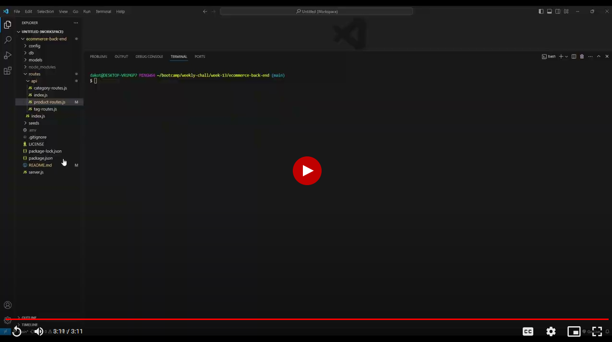

# E-Commerce Back End

## Table Of Contents
* [Description](#description)
* [Installation](#installation)
* [How To Test](#how-to-test)
* [Demo](#demo)
* [Tools](#tools)
* [Credits](#credits)
* [License](#license)

## Description
Back-end code for an ecommerce application using MySQL and Sequalize to easily manage items in a database.

## Installation
1. Make sure to have [MySQL](https://www.mysql.com/) and [Node.js](https://nodejs.org/en) installed before continuing
2. Download code files
3. In your downloaded files, rename '.env.EXAMPLE' to '.env'
4. Open your .env file and add your MySQL username and password between the empty quotes
5. Navigate your CLI to the folder containing the code files
6. Run the code `npm i` to install dependencies from package.json
7. Enter `mysql -u root -p` and enter your MySQL password when prompted
8. Once in MySQL, run the code `source db/schema.sql` to set up the schematics of the database
9. Exit MySQL by typing `quit`
10. Seed the database with test data by running the code `npm run seed`

## How to Test
1. Install the application [Insomnia](https://insomnia.rest/products/insomnia)
2. Navigate your CLI to the folder containing code files and start the server.js \
    This can be done using nodemon by running the code `npx nodemon server.js`
3. Now you are able to test all your CRUD routes within Insomnia

## Demo

## Tools
* [MySQL](https://www.mysql.com/)
* [Node.js](https://nodejs.org/en)
* [Express.js](https://expressjs.com/)
* [Sequalize](https://sequelize.org/)
* [DotENV](https://www.npmjs.com/package/dotenv)
* [Insomnia](https://insomnia.rest/products/insomnia)

## Credits
[E-COMMERCE BACK END STARTER CODE](https://github.com/coding-boot-camp/fantastic-umbrella)

## License
